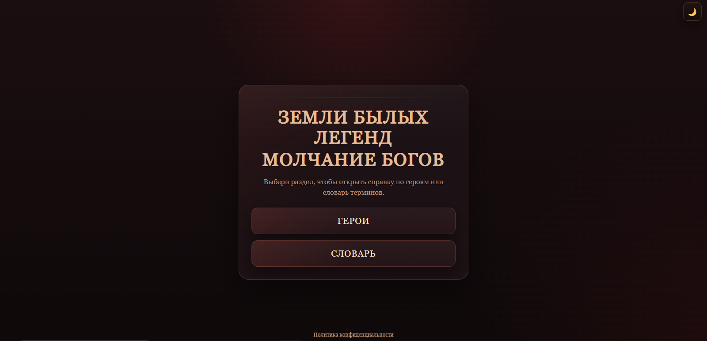
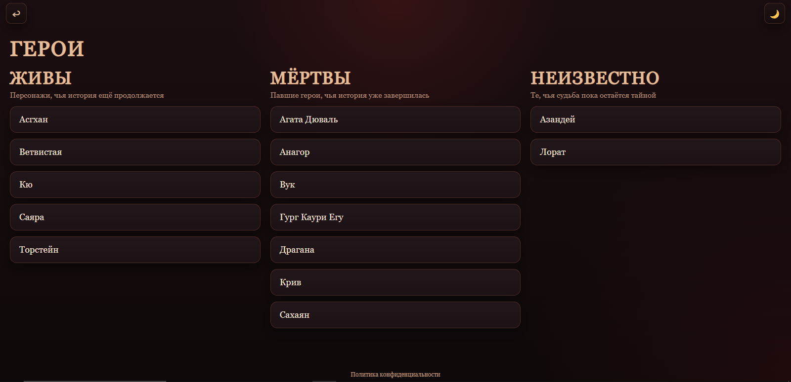
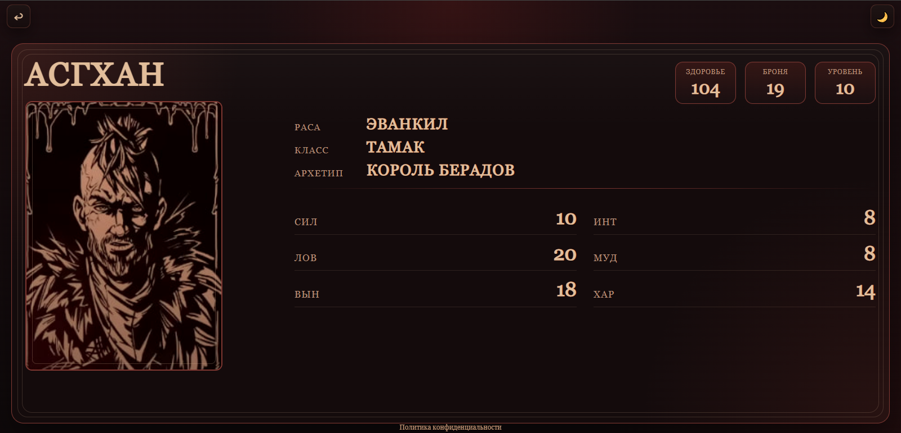
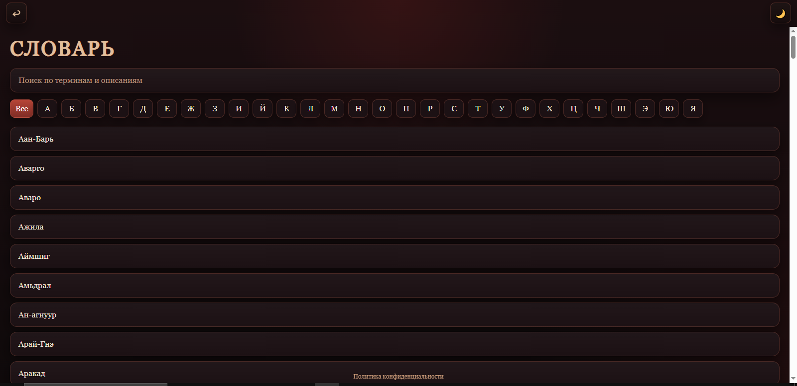
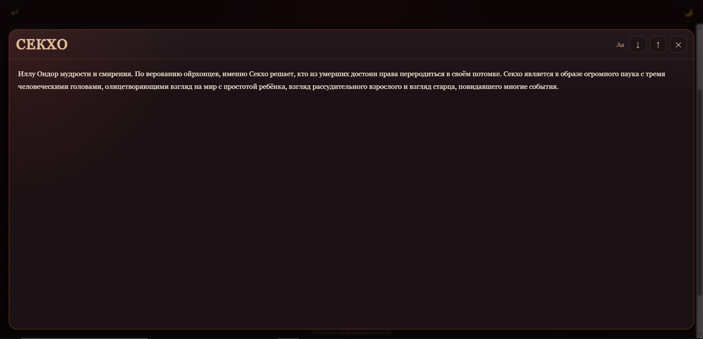
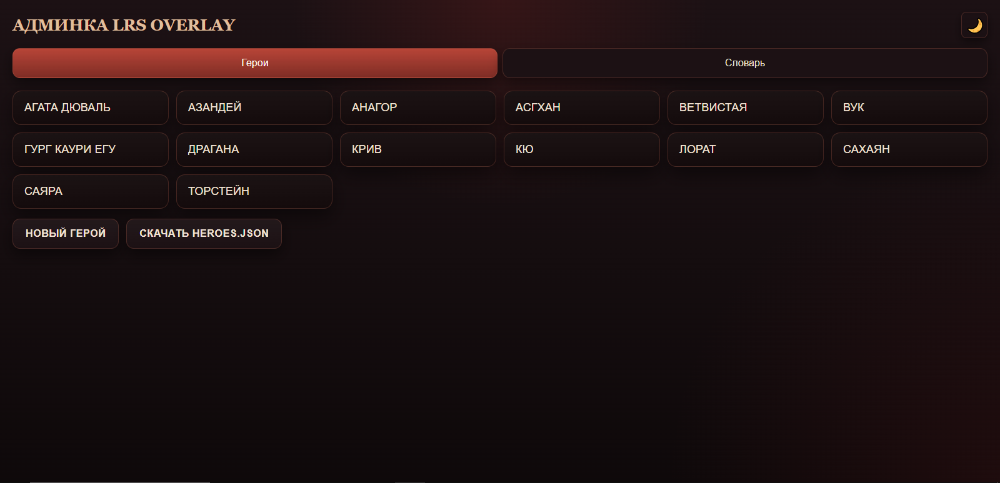
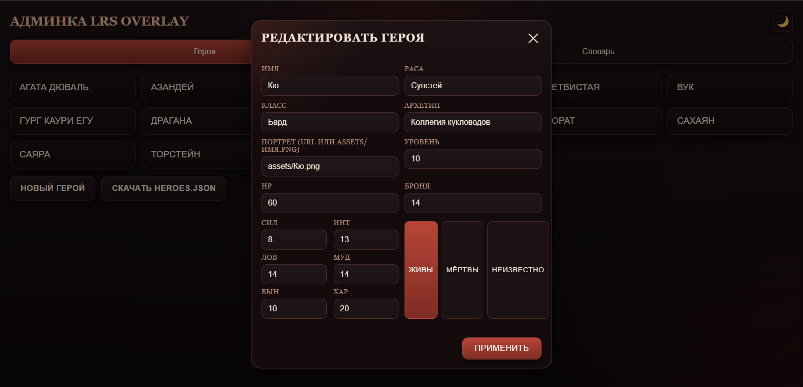
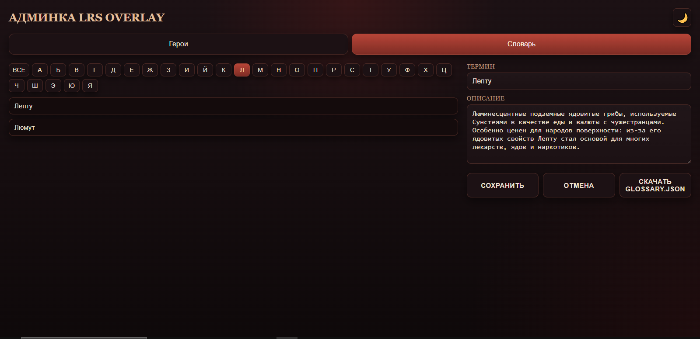

#  LRS Twitch Overlay

Интерактивное Twitch‑расширение для зрителей кампании **«Земли былых легенд: Молчание богов»**. Оно открывается поверх видеоплеера и показывает карточки героев, словарь мира и другую справочную информацию прямо на трансляции, не требуя авторизации или активности в чате.

## Быстрый старт

| | |
|---|---|
| **Демо для зрителей** | [kao820.github.io/twitch-overlay](https://kao820.github.io/twitch-overlay/) |
| **Админка** | [kao820.github.io/twitch-overlay/editor.html](https://kao820.github.io/twitch-overlay/editor.html) |
| **Как подключить к своему каналу** | Напишите в Telegram: [@kalmykova_alyona](https://t.me/kalmykova_alyona) и укажите название своего Twitch‑канала. Вас добавят в белый список и вы сможете включить расширение. |

---

<strong>Вкладка 1 — О расширении, скриншоты и структура репозитория</strong>

### Что это за расширение

LRS Twitch Overlay — дополнение для Twitch с внутриигровой справкой для зрителей. Оно добавляет поверх трансляции панель, где можно:

- просмотреть список героев и открыть их карточки;
- открыть словарь терминов мира, искать по названию и описанию, фильтровать по алфавиту;
- увеличить или уменьшить размер шрифта в карточках и терминах;
- вернуться на главный экран кнопкой **«Назад»**;
- переключать светлую и тёмную тему.

### Скриншоты

| Вид | Скриншот |
|---|---|
| **Главная страница** |  |
| **Список героев** |  |
| **Карточка героя** |  |
| **Словарь — список** |  |
| **Словарь — открытый термин** |  |
| **Админка — список героев** |  |
| **Админка — форма героя** |  |
| **Админка — словарь** |  |

### Структура репозитория
* assets/ # портреты героев
*  data/ # JSON‑файлы с данными
   *  heroes.json # заведённые гером
   *  glossary.json # заведённые термины
*  index.html # основной вход зрительской части
*  viewer.html # дополнительная страница для старого подключения
*  viewer.js # логика зрительского интерфейса
*  scripts.js # обратная совместимость старого скрипта
*  styles.css # стили зрительской части, светлая и тёмная темы, адаптив
*  editor.html # интерфейс административной панели
*  editor.js # логика редактирования героев и словаря
*  admin.css # стили админки
*  manifest.json # конфигурация расширения для Twitch

<strong>Вкладка 2 — Как обновлять героев и словарь</strong>

### Обновление данных через админку

Это основной и рекомендуемый способ редактирования контента. Все изменения сохраняются локально в виде JSON‑файлов, которые необходимо загрузить в репозиторий.

1. Откройте админку: [editor.html](https://kao820.github.io/twitch-overlay/editor.html).
2. Для **героев** перейдите во вкладку «Герои», выберите персонажа, отредактируйте поля (имя, раса, класс, архетип, портрет, уровень, здоровье, броня, характеристики, статус) и нажмите **«Применить»**.
3. Для **словаря** перейдите во вкладку «Словарь», выберите букву или термин, измените название и описание, затем нажмите **«Сохранить»**.
4. После завершения изменений скачайте соответствующий JSON‑файл (кнопки **«Download heroes.json»** или **«Download glossary.json»**).
5. Замените старые файлы в папке `data/` вашего репозитория на новые версии. После обновления GitHub Pages обновление будет доступно по ссылкам.

#### Ручное редактирование JSON

При необходимости вы можете редактировать файлы `data/heroes.json` и `data/glossary.json` вручную (например, для массовых правок). Важно сохранять корректную JSON‑структуру: не удаляйте обязательные поля, следите за кавычками и запятыми и при сомнениях проверяйте файлы валидатором JSON. 

<strong>Вкладка 3 — Подключение к каналу и контакты</strong>

### Как подключить расширение на свой Twitch‑канал

Расширение пока подключается в ручном режиме. Чтобы ваш канал был добавлен в белый список:

1. Свяжитесь в Telegram с [@kalmykova_alyona](https://t.me/kalmykova_alyona).
2. Укажите название своего Twitch‑канала и ссылку на него.
3. Ваш канал будет добавлен в белый список, и вы сможете активировать LRS Twitch Overlay в настройках Twitch Extensions.
